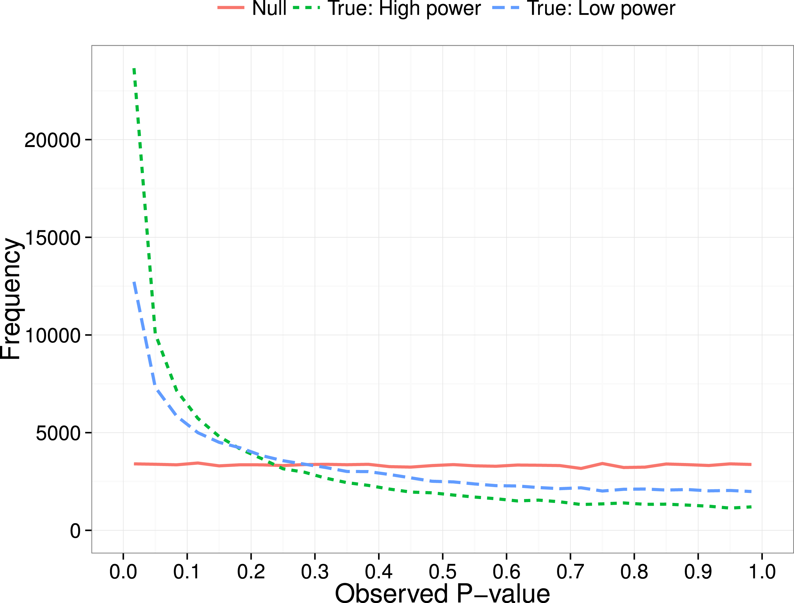

```{r setup, include=FALSE}
options(htmltools.dir.version = FALSE)
knitr::opts_chunk$set(
  fig.width=9, fig.height=3.5, fig.retina=3,
  out.width = "100%",
  cache = FALSE,
  echo = TRUE,
  message = FALSE, 
  warning = FALSE,
  hiline = TRUE
)
```

```{r xaringan-themer, include=FALSE, warning=FALSE}
library(xaringanthemer)

style_duo_accent(
  primary_color = "#2f4871",
  secondary_color = "#2e91af",
  inverse_header_color = "#FFFFFF",
  header_color = "#106075",
  background_color = "#e9ebee",
  header_font_google = google_font("Oswald", "700", "700i"),
  text_font_google = google_font("Spartan", "400", "400i",
                                 "700", "700i"),
  code_font_google = google_font("Fira Code", "400",
                                 "700"),
  outfile = "xaringan-lis.css"
)
```

```{r xaringan-tile-view, echo=FALSE}
xaringanExtra::use_tile_view()
```

```{r broadcast, echo=FALSE}
xaringanExtra::use_broadcast()
```

```{r xaringan-scribble, echo=FALSE}
xaringanExtra::use_scribble()
```

```{r xaringan-panelset, echo=FALSE}
xaringanExtra::use_panelset()
```

```{r xaringanExtra-clipboard, echo=FALSE}
htmltools::tagList(
  xaringanExtra::use_clipboard(
    button_text = "<i class=\"fa fa-clipboard\"></i>",
    success_text = "<i class=\"fa fa-check\" style=\"color: #90BE6D\"></i>",
    error_text = "<i class=\"fa fa-times-circle\" style=\"color: #F94144\"></i>"
  ),
  rmarkdown::html_dependency_font_awesome()
)
```

```{r xaringan-logo, echo=FALSE}
xaringanExtra::use_logo(
  image_url = "img/InnovaLab_logo_blue.png",
  width = "100px",
  height = "116px"
)
```

```{r xaringan-extra-styles, echo=FALSE}
xaringanExtra::use_extra_styles(
  hover_code_line = TRUE,         
  mute_unhighlighted_code = TRUE  
)
```

```{r xaringanExtra, echo = FALSE}
xaringanExtra::use_progress_bar(color = "#0051BA",
                                location = "bottom")
```

## Acerca del curso


---
name: colors

## Exploración competencial

.pull-left[.line-space2-5[
- Investigación Reproducible 
- P-Hacking
- Harking
- Sesgo de publicación
- Pre-registro de investigación
- Datos abiertos
]] 

.pull-right[

]

---

# Investigación reproducible

---

# P-Hacking

.pull-left[.line-space2-0[
- Alteración artificial de los valores p en el análisis de resultados
- Duplicar los datos de forma artificial
- 
]]

.pull-right[
```{r echo=FALSE, out.width="70%", fig.align='center'}

```
]


---

# Harking

---

# Sesgo de publicación

---

# Pre-registro de investigación

---

# Datos abiertos

---
# Práctica Supervisada

.left-column[

]

.right-column[

]

```{r echo=FALSE}
countdown::countdown(minutes = 8,
                     margin = "1em")
```

---
layout: false

## Square image

<center></center>

.footnote[GitHub Octocat]

---

### Wide image


.footnote[Wide images scale to 100% slide width]

---

## Two images

.pull-left[

]

.pull-right[

]

---
class: center, middle

# Thanks!

Slides created via the R packages:

[**xaringan**](https://github.com/yihui/xaringan)<br>
[gadenbuie/xaringanthemer](https://github.com/gadenbuie/xaringanthemer)

The chakra comes from [remark.js](https://remarkjs.com), [**knitr**](http://yihui.name/knitr), and [R Markdown](https://rmarkdown.rstudio.com).
